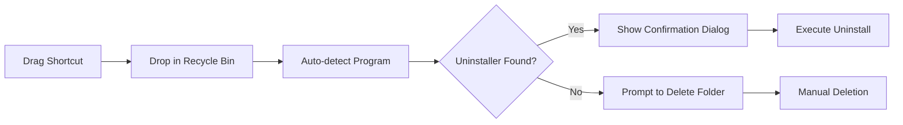
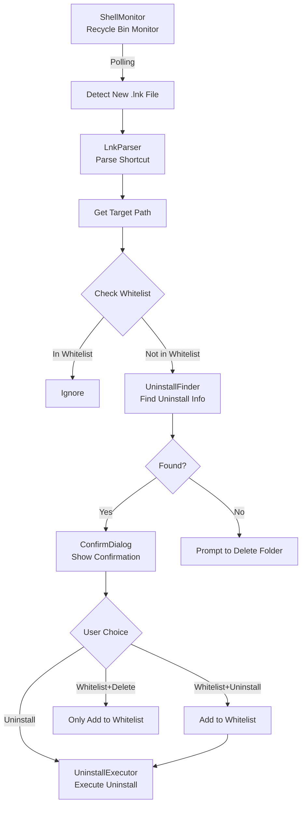

# 🚀 KuaiGunAPP! (Get Lost APP!)

<div align="center">

**[中文](README.md)** | **[English](#readme)**

---


**A convenient Windows software uninstaller tool that makes unwanted software "Get Lost"!**

[Website](https://kgapp.wcshen.top) · [Download](installer/KuaiGunAPP_Setup_v1.0.0.exe) · [Report Issues](../../issues)

</div>

---

## 📖 Project Introduction

**KuaiGunAPP!** is an innovative Windows application uninstaller tool that allows you to quickly and thoroughly uninstall unwanted software through a unique "drag to Recycle Bin" interaction.

### ✨ Core Features

- 🎯 **Smart Detection** - Automatically identifies program uninstallation information and precisely locates uninstall entries in the registry
- 🗑️ **Drag & Drop Uninstall** - Simply drag shortcuts to the Recycle Bin to trigger the uninstall process
- 📋 **Whitelist Management** - Supports adding programs to whitelist to prevent accidental deletion of important applications
- 🔍 **Deep Scanning** - Multi-level matching algorithm ensures finding the correct uninstaller
- ⚡ **Lightweight & Efficient** - Resides in system tray, auto-starts with Windows, always ready
- 🔒 **Safe & Reliable** - Double confirmation before operations to prevent accidental actions

---

## 🚀 Quick Start

### Installation

Download and run [`KuaiGunAPP_Setup_v1.0.0.exe`](installer/KuaiGunAPP_Setup_v1.0.0.exe), follow the wizard to complete installation.

### First Time Use

1. **Installation Complete** - On first run, the program starts in the background and monitors the system tray
2. **Check System Tray** - Find the "KuaiGunAPP!" icon in the system tray
3. **Start Uninstalling** - Drag any program's shortcut to the Recycle Bin to trigger the uninstall prompt

---

## 💡 User Guide

### Basic Workflow



### Tray Menu Functions

Right-click the tray icon to access the following functions:

| Function | Description |
|------|------|
| **Monitor Status** | Shows current monitoring status (Monitoring/Paused) |
| **Pause Monitoring** | Temporarily pause Recycle Bin monitoring |
| **Resume Monitoring** | Resume paused monitoring |
| **Whitelist** | Manage programs excluded from monitoring |
| **Auto Start** | Toggle Windows startup on boot |
| **About** | View software information and version |
| **Exit** | Completely exit the program |

### Whitelist Management

The whitelist feature allows you to exclude certain programs from being monitored:

1. Right-click tray icon → Select "Whitelist"
2. In the whitelist management interface:
   - Click ❌ to remove a single program
   - Click "Clear All" to remove all whitelist items
3. Programs in the whitelist won't trigger uninstall prompts when dragged to Recycle Bin

### Uninstall Confirmation Dialog

When a shortcut is detected being dragged to the Recycle Bin, a confirmation dialog will appear:

- **Uninstall** - Execute the program's official uninstaller
- **Whitelist & Uninstall** - Add to whitelist then execute uninstall
- **Whitelist & Delete** - Only add to whitelist, don't uninstall
- **Cancel** - Cancel this operation

---

## 🛠️ Technical Architecture

### Core Tech Stack

- **Language**: C# / .NET 6.0
- **UI Framework**: Windows Forms
- **System API**: Win32 API, Registry API
- **Packaging Tool**: Inno Setup

### How It Works



### Core Modules

| Module | File | Description |
|------|------|----------|
| **ShellMonitor** | `ShellMonitor.cs` | Polls Recycle Bin directory to detect new shortcut files |
| **LnkParser** | `LnkParser.cs` | Parses `.lnk` shortcut files to get target program path |
| **UninstallFinder** | `UninstallFinder.cs` | Searches registry for program uninstall info using multi-level matching |
| **UninstallExecutor** | `UninstallExecutor.cs` | Executes uninstall commands with UAC elevation support |
| **Whitelist** | `Whitelist.cs` | Whitelist management with persistent storage to config file |
| **TrayIcon** | `TrayIcon.cs` | System tray icon with custom rounded menu |
| **MainForm** | `MainForm.cs` | Main window (hidden), coordinates the entire uninstall process |

### Smart Matching Algorithm

`UninstallFinder` uses a multi-dimensional scoring mechanism to accurately find the corresponding uninstaller:

1. **InstallLocation Prefix Match** (+100 points) - Highest priority
2. **DisplayIcon Path Match** (+80 points) - Exact icon path match
3. **Path Contains** (+40 points) - Partial path match
4. **UninstallString Keywords** (+20 points) - Directory name in uninstall command
5. **DisplayName Name Match** (+10 points) - Program name contains exe filename

---

## 📂 Project Structure

```
GunAPP/
├── public/                  # Resource files
│   ├── logo.ico            # Application icon
│   └── logo.png            # Logo image
├── installer/              # Installer package
│   └── KuaiGunAPP_Setup_v1.0.0.exe
├── publish/                # Published files
│   ├── GunAPP.exe
│   └── GunAPP.pdb
├── MainForm.cs             # Main window
├── ShellMonitor.cs         # Recycle Bin monitor
├── UninstallFinder.cs      # Uninstall info finder
├── UninstallExecutor.cs    # Uninstall executor
├── Whitelist.cs            # Whitelist manager
├── TrayIcon.cs             # Tray icon
├── ConfirmDialog.cs        # Confirmation dialog
├── WhitelistForm.cs        # Whitelist interface
├── AboutForm.cs            # About page
├── NotifyForm.cs           # Notification popup
├── AutoStart.cs            # Auto-start on boot
├── LnkParser.cs            # Shortcut parser
├── NativeMethods.cs        # Win32 API wrapper
├── Program.cs              # Program entry point
├── GunAPP.csproj           # Project file
├── GunAPP.sln              # Solution file
├── installer.iss           # Inno Setup script
└── build.ps1               # Build script
```


<div align="center">

**Official Website**: [https://kgapp.wcshen.top](https://kgapp.wcshen.top)

Made with ❤️ for Windows Users

</div>
