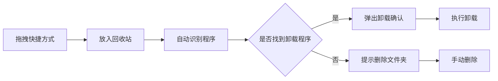
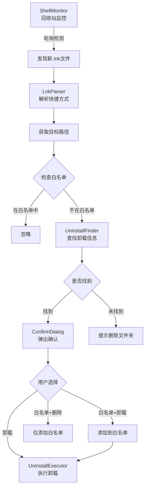

# 🚀 快滚!APP!

<div align="center">

**[中文](#readme)** | **[English](README.en.md)**

---


**一个便捷的 Windows 软件卸载工具，让不需要的软件"快滚"！**

[官网](https://kgapp.wcshen.top) · [下载安装](installer/KuaiGunAPP_Setup_v1.0.0.exe) · [报告问题](../../issues)

</div>

---

## 📖 项目简介

**快滚!APP!** 是一款创新的 Windows 应用程序卸载工具，通过独特的"拖拽到回收站"交互方式，让您快速、彻底地卸载不需要的软件。

**KuaiGunAPP!** is an innovative Windows application uninstaller tool that allows you to quickly and thoroughly uninstall unwanted software through a unique "drag to Recycle Bin" interaction.

### ✨ 核心特性

- 🎯 **智能识别** - 自动识别程序的卸载信息，精准定位注册表中的卸载入口
- 🗑️ **拖拽卸载** - 只需将快捷方式拖入回收站，即可触发卸载流程
- 📋 **白名单管理** - 支持添加白名单，避免误删重要程序
- 🔍 **深度扫描** - 多级匹配算法，确保找到正确的卸载程序
- ⚡ **轻量高效** - 常驻系统托盘，开机自启动，随时待命
- 🔒 **安全可靠** - 操作前二次确认，防止误操作

---

## 🚀 快速开始

### 安装方式

下载并运行 [`KuaiGunAPP_Setup_v1.0.0.exe`](installer/KuaiGunAPP_Setup_v1.0.0.exe)，按照向导完成安装。

Download and run [`KuaiGunAPP_Setup_v1.0.0.exe`](installer/KuaiGunAPP_Setup_v1.0.0.exe), follow the wizard to complete installation.

### 首次使用

1. **安装完成** - 首次运行时，程序会在后台启动并监控系统托盘
2. **查看托盘** - 在系统托盘中找到 "快滚!APP!" 图标
3. **开始卸载** - 将任意程序的快捷方式拖入回收站，即可触发卸载提示

---

## 💡 使用指南

### 基本操作流程



### 托盘菜单功能

右键点击托盘图标，可以访问以下功能：

| 功能 | 说明 |
|------|------|
| **监控状态** | 显示当前监控状态（监控中/已暂停） |
| **暂停监控** | 临时暂停回收站监控功能 |
| **恢复监控** | 恢复被暂停的监控功能 |
| **白名单管理** | 管理不需要监控的程序列表 |
| **开机自启动** | 设置是否随系统启动 |
| **关于** | 查看软件信息和版本 |
| **退出** | 完全退出程序 |

### 白名单管理

白名单功能可以让您排除某些不想被监控的程序：

1. 右键托盘图标 → 选择"白名单"
2. 在白名单管理界面中：
   - 点击 ❌ 删除单个程序
   - 点击"清空全部"清除所有白名单项
3. 拖拽到回收站的白名单程序将不会被提示卸载

### 卸载确认对话框

当检测到快捷方式被拖入回收站时，会弹出确认对话框：

- **卸载** - 执行程序的官方卸载程序
- **加入白名单并卸载** - 添加到白名单后执行卸载
- **加入白名单并删除** - 仅添加到白名单，不执行卸载
- **取消** - 取消本次操作

---

## 🛠️ 技术架构

### 核心技术栈

- **开发语言**: C# / .NET 6.0
- **UI 框架**: Windows Forms
- **系统 API**: Win32 API, Registry API
- **打包工具**: Inno Setup

### 工作原理



### 核心模块说明

| 模块 | 文件 | 功能描述 |
|------|------|----------|
| **ShellMonitor** | `ShellMonitor.cs` | 轮询监控回收站目录，检测新增的快捷方式文件 |
| **LnkParser** | `LnkParser.cs` | 解析 `.lnk` 快捷方式文件，获取目标程序路径 |
| **UninstallFinder** | `UninstallFinder.cs` | 在注册表中搜索程序的卸载信息，采用多级匹配算法 |
| **UninstallExecutor** | `UninstallExecutor.cs` | 执行卸载命令，支持 UAC 提权 |
| **Whitelist** | `Whitelist.cs` | 白名单管理，持久化存储到配置文件 |
| **TrayIcon** | `TrayIcon.cs` | 系统托盘图标和自定义圆角菜单 |
| **MainForm** | `MainForm.cs` | 主窗口（隐藏），协调整个卸载流程 |

### 智能匹配算法

`UninstallFinder` 采用多维度评分机制，确保准确找到对应的卸载程序：

1. **InstallLocation 前缀匹配** (+100分) - 最高优先级
2. **DisplayIcon 路径比对** (+80分) - 图标路径完全匹配
3. **路径包含关系** (+40分) - 部分路径匹配
4. **UninstallString 关键词** (+20分) - 卸载命令中包含目录名
5. **DisplayName 名称匹配** (+10分) - 程序名包含 exe 文件名

---

## 📂 项目结构

```
GunAPP/
├── public/                  # 资源文件
│   ├── logo.ico            # 应用图标
│   └── logo.png            # Logo 图片
├── installer/              # 安装包
│   └── KuaiGunAPP_Setup_v1.0.0.exe
├── publish/                # 发布文件
│   ├── GunAPP.exe
│   └── GunAPP.pdb
├── MainForm.cs             # 主窗口
├── ShellMonitor.cs         # 回收站监控
├── UninstallFinder.cs      # 卸载信息查找
├── UninstallExecutor.cs    # 卸载执行器
├── Whitelist.cs            # 白名单管理
├── TrayIcon.cs             # 托盘图标
├── ConfirmDialog.cs        # 确认对话框
├── WhitelistForm.cs        # 白名单界面
├── AboutForm.cs            # 关于页面
├── NotifyForm.cs           # 通知弹窗
├── AutoStart.cs            # 开机自启
├── LnkParser.cs            # 快捷方式解析
├── NativeMethods.cs        # Win32 API 封装
├── Program.cs              # 程序入口
├── GunAPP.csproj           # 项目文件
├── GunAPP.sln              # 解决方案
├── installer.iss           # Inno Setup 脚本
└── build.ps1               # 构建脚本
```


<div align="center">

**官方网站**: [https://kgapp.wcshen.top](https://kgapp.wcshen.top)

Made with ❤️ for Windows Users

</div>
